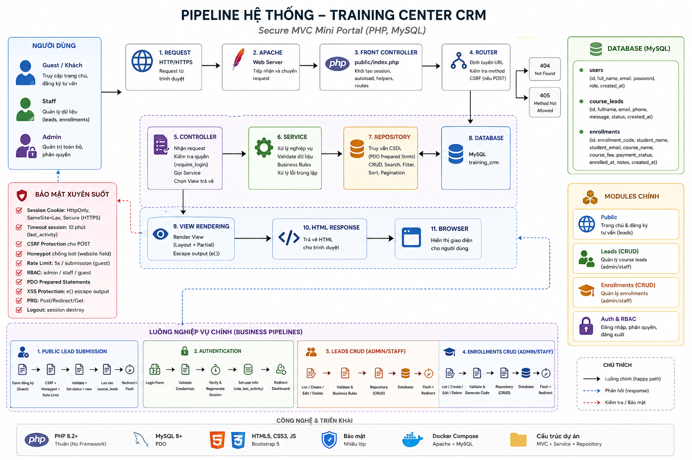

# Training Center CRM - Secure MVC Mini Portal

Dự án **Training Center CRM** là một hệ thống web portal nội bộ quản lý thông tin tư vấn học viên tiềm năng (Course Leads) và thông tin đăng ký khóa học/học phí (Enrollments) được xây dựng theo mô hình kiến trúc MVC (Model-View-Controller) thuần bằng PHP, kết hợp với các kỹ thuật bảo mật nâng cao và tối ưu hóa cơ sở dữ liệu.

---

## 🚀 Tính Năng & Bảo Mật Nổi Bật

1. **Kiến trúc MVC chuẩn:** Tách biệt hoàn toàn phần xử lý nghiệp vụ (Service), tương tác CSDL (Repository), điều phối (Controller), và giao diện hiển thị (View/Layout/Partial).
2. **Session Security & Timeout:**
   - Session cookies được cấu hình với các cờ bảo mật `HttpOnly` (chống XSS đánh cắp session cookie), `SameSite=Lax` (giảm thiểu rủi ro CSRF), và `Secure` khi chạy dưới HTTPS.
   - Cơ chế tự động hủy session khi không hoạt động quá 10 phút (Inactivity Timeout).
   - Gọi `session_regenerate_id(true)` ngay sau khi đăng nhập thành công chống tấn công Session Fixation.
3. **Bảo vệ CSRF:**
   - Tích hợp Token bảo mật CSRF dùng một lần (`csrf_field()`) cho **tất cả các form sử dụng phương thức POST** (Đăng nhập, Đăng xuất, Thêm mới, Cập nhật, Xóa) nhằm ngăn chặn hoàn toàn tấn công giả mạo yêu cầu từ trang web khác.
4. **Phân Quyền Người Dùng (Role Authorization - RBAC):**
   - Phân biệt rõ vai trò `admin` và `staff`.
   - Chỉ tài khoản có vai trò `admin` mới được cấp quyền thực thi hành động Xóa bản ghi (Course Leads và Enrollments). Người dùng có vai trò `staff` chỉ được phép xem danh sách, tạo mới và chỉnh sửa thông tin/trạng thái.
5. **Anti-Spam cho Form Công Khai:**
   - **Honeypot Field:** Field ẩn `website` trên form đăng ký tư vấn học viên. Nếu bot điền dữ liệu vào field này, request sẽ bị bỏ qua một cách im lặng.
   - **Rate Limiting:** Giới hạn thời gian tối thiểu giữa các lần gửi đăng ký tư vấn là 5 giây (sử dụng session tracking).
6. **Bảo Mật Form & PRG Pattern:**
   - Áp dụng triệt để mô hình **Post-Redirect-Get (PRG)** sau khi thêm/sửa/xóa thành công nhằm chống submit trùng lặp dữ liệu khi người dùng làm mới trang (F5).
   - Tự động giữ lại dữ liệu cũ khi có lỗi kiểm định (Preserve Old Input) và hiển thị thông báo lỗi thân thiện.
7. **Database Quality & Safety:**
   - Dữ liệu đầu vào luôn được chạy qua prepared statements của PDO giúp triệt tiêu hoàn toàn nguy cơ tấn công SQL Injection.
   - Escape toàn bộ dữ liệu hiển thị ra View bằng hàm `e()` phòng chống tấn công XSS.
   - Thiết kế Database được tối ưu hóa với các chỉ mục (Indexes) trên cột tìm kiếm và sắp xếp.
   - Bắt và xử lý ngoại lệ trùng lặp (`DuplicateRecordException`) có kiểm soát và an toàn ở môi trường production (không hiển thị SQLSTATE, tên bảng, hay stack trace lỗi).

---

## 📐 Kiến trúc & Pipeline hệ thống

Dưới đây là sơ đồ luồng hoạt động (pipeline) của hệ thống:



---

## 🔑 Tài Khoản Demo

- **Admin Account:** `admin@example.com`
- **Mật khẩu:** `123456`

---

## 📑 Danh Sách Routes Hệ Thống

| Method | URL | Controller@Action | Mô tả |
| :--- | :--- | :--- | :--- |
| **GET** | `/` | `HomeController@index` | Trang landing page công khai chứa Form đăng ký tư vấn học viên |
| **POST** | `/leads/public-store` | `HomeController@publicStore` | Xử lý đăng ký tư vấn học viên công khai (chống spam honeypot/rate limit) |
| **GET** | `/login` | `AuthController@login` | Hiển thị giao diện đăng nhập Admin |
| **POST** | `/login` | `AuthController@handleLogin` | Xử lý xác thực đăng nhập |
| **POST** | `/logout` | `AuthController@logout` | Hủy session và đăng xuất |
| **GET** | `/dashboard` | `DashboardController@index` | Giao diện tổng quan hệ thống (Yêu cầu Login) |
| **GET** | `/leads` | `LeadController@index` | Danh sách Lead học viên kết hợp tìm kiếm, phân trang và sắp xếp an toàn |
| **GET** | `/leads/create` | `LeadController@create` | Form thêm mới Lead học viên thủ công |
| **POST** | `/leads/store` | `LeadController@store` | Xử lý lưu thông tin Lead học viên |
| **GET** | `/leads/edit` | `LeadController@edit` | Giao diện chỉnh sửa Lead học viên |
| **POST** | `/leads/update` | `LeadController@update` | Xử lý cập nhật thông tin Lead học viên |
| **POST** | `/leads/delete` | `LeadController@delete` | Xóa Lead học viên |
| **GET** | `/enrollments` | `EnrollmentController@index` | Danh sách phiếu đăng ký học phí có tìm kiếm, phân trang, và lọc trạng thái |
| **GET** | `/enrollments/create` | `EnrollmentController@create` | Form thêm mới phiếu đăng ký học viên (tự động tạo mã ENR) |
| **POST** | `/enrollments/store` | `EnrollmentController@store` | Xử lý lưu thông tin phiếu đăng ký |
| **GET** | `/enrollments/edit` | `EnrollmentController@edit` | Giao diện chỉnh sửa phiếu đăng ký |
| **POST** | `/enrollments/update` | `EnrollmentController@update` | Xử lý cập nhật phiếu đăng ký |
| **POST** | `/enrollments/delete` | `EnrollmentController@delete` | Xóa phiếu đăng ký học viên |
| **GET** | `/health` | `HealthController@index` | API kiểm tra trạng thái sức khỏe của ứng dụng và Database |

---

## 🐳 Hướng Dẫn Cài Đặt Và Khởi Chạy (Docker)

### 1. Khởi chạy các Containers
Chạy lệnh sau tại thư mục chứa dự án để build và khởi động Apache Web Server và MySQL Database:
```bash
docker-compose up -d
```

### 2. Thiết lập Database & Seed Dữ Liệu
Sau khi các Container đã hoạt động ổn định, nạp cấu trúc cơ sở dữ liệu và dữ liệu mẫu (để kiểm tra phân trang) bằng cách chạy:
```bash
# Nạp cấu trúc bảng (schema)
docker exec -i crm_db mysql -uroot -proot training_crm < database/schema.sql

# Nạp dữ liệu mẫu (seeds)
docker exec -i crm_db mysql -uroot -proot training_crm < database/seed.sql
```

### 3. Truy cập ứng dụng
- Địa chỉ truy cập: [http://localhost:8006](http://localhost:8006)
- Endpoint Healthcheck: [http://localhost:8006/health](http://localhost:8006/health)

---

## 🧪 Chạy Tập Lệnh Kiểm Thử Tự Động (Integration Tests)
Để xác thực các Test Cases bắt buộc (kiểm tra phân quyền, lọc dữ liệu nguy hiểm, xử lý dữ liệu trùng lặp, rate-limiting, honeypot...), thực hiện lệnh chạy test trực tiếp bên trong Container:
```bash
docker exec -i crm_web php /var/www/html/scratch/test_crm.php
```

---

## 📁 Cấu Trúc Thư Mục Dự Án (Folder Structure)

```text
├── app/                  # Thư mục mã nguồn chính (MVC)
│   ├── Controllers/      # Các Controller nhận và điều hướng request
│   ├── Core/             # Lớp cốt lõi hệ thống (Database, Router, Exceptions, helpers...)
│   ├── Repositories/     # Lớp tương tác CSDL trực tiếp (Chạy các câu lệnh SQL)
│   ├── Services/         # Xử lý logic nghiệp vụ chính (Validation, Business logic)
│   └── Views/            # Chứa các file giao diện HTML/PHP (Layouts, Partials)
├── config/               # Thư mục chứa cấu hình hệ thống (app.php, database.php)
├── database/             # File cấu trúc CSDL và các script seed dữ liệu mẫu
│   ├── schema.sql        # Cấu trúc bảng và ràng buộc khóa ngoại
│   ├── seed.sql          # Seed dữ liệu mặc định ban đầu
│   └── seed_data.php     # Script PHP seed dữ liệu dummy số lượng lớn (150+ dòng)
├── public/               # Thư mục gốc web chứa file index.php và assets tĩnh (CSS, JS)
├── scratch/              # Thư mục chứa script kiểm thử tự động (test_crm.php)
├── storage/              # Chứa file log nhật ký hệ thống (logs/app.log)
├── docker-compose.yml    # Định nghĩa cấu hình môi trường chạy Docker
└── README.md             # Tài liệu hướng dẫn dự án
```

---

## ⚠️ Lưu Ý Cấu Hình Môi Trường (Debug vs Production)

*   **Môi trường Development (Debug Mode - Bật):**
    *   Cấu hình trong `config/app.php`: thiết lập `'debug' => true`.
    *   Hệ thống sẽ hiển thị chi tiết các thông báo lỗi và Stack Trace trực tiếp trên màn hình giúp lập trình viên gỡ lỗi nhanh chóng.
*   **Môi trường Production (Debug Mode - Tắt):**
    *   Cấu hình trong `config/app.php`: thiết lập `'debug' => false`.
    *   Ẩn hoàn toàn chi tiết lỗi kỹ thuật để tránh lộ thông tin nhạy cảm. Hệ thống hiển thị trang lỗi 500 thân thiện: *"Đã có lỗi hệ thống xảy ra. Vui lòng liên hệ quản trị viên."*
    *   Mọi thông tin lỗi phát sinh sẽ được ghi nhận tự động vào **`storage/logs/app.log`** để quản trị viên tiện tra cứu và xử lý lỗi.

